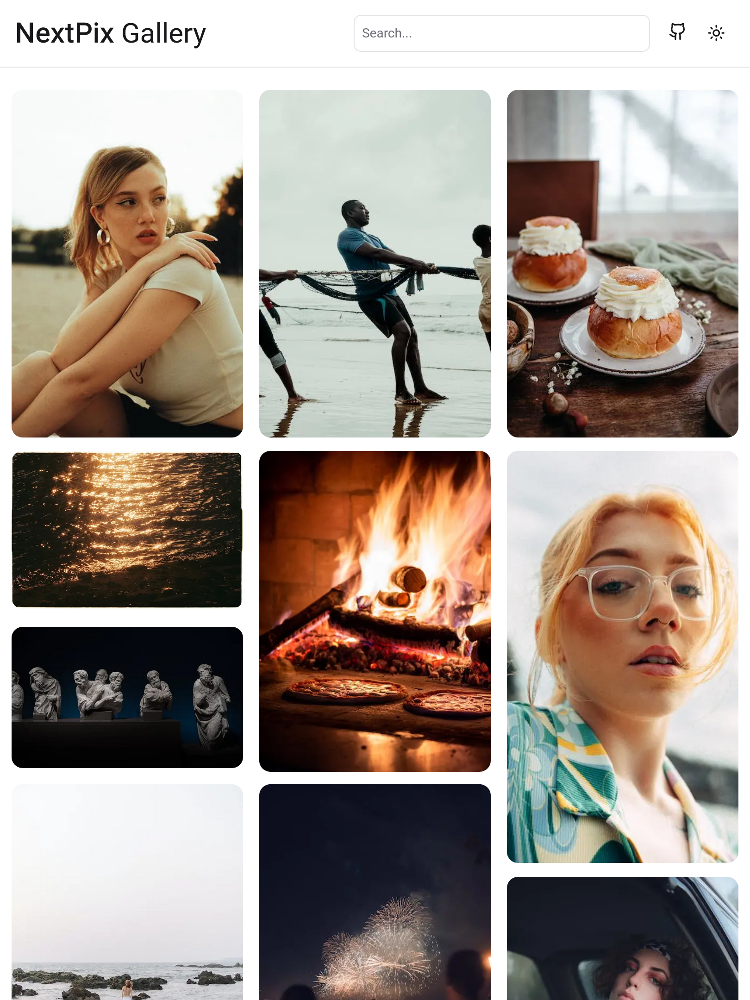

# NextPix Gallery

NextPix Gallery is a simple image gallery web application built with Next.js App Directory, Tailwind CSS, Shadcn UI, TypeScript, and Zod. It fetches images from the Pexels API and displays them in an elegant gallery format.

## Preview

### Dark Mode


### Light Mode



## Features

-  Browse and view high-quality images from Pexels.
-  Responsive design for optimal viewing on various devices.
-  A clean and modern user interface.
-  dark theme.
-  TypeScript for enhanced code quality and autocompletion.
-  Zod for runtime type checking.

## Prerequisites

Before you begin, ensure you have the following prerequisites:

-  **Fundamentals of Next.js, TypeScript, and Tailwind CSS:** Familiarity with these technologies will be helpful for understanding and customizing the project.

-  **Node.js (npm / npx):** Make sure you have Node.js installed on your system. You can download it from [nodejs.org](https://nodejs.org/).

-  **Next.js:** You'll need to be familiar with Next.js, as this project is built using it. You can learn more about Next.js by visiting the [official documentation](https://nextjs.org/docs).

-  **Pexels API Key:** To fetch images from the Pexels API, you'll need to obtain an API key. You can sign up for a Pexels API key at [pexels.com/api](https://www.pexels.com/api/). After obtaining the API key, add it to a `.env.local` file in the project root as described in the Getting Started section.

## Getting Started

To get started with NextPix Gallery, follow these steps:

1. Clone the repository to your local machine:

```bash
    git clone https://github.com/mohamed-lifa7/NextPix-Gallery.git
```

2. Navigate to the project directory:

```bash
   cd NextPix-Gallery
```

3. Install the project dependencies:

```bash
   npm install
```

4. Create a .env.local file in the project root and add your Pexels API key:

```plaintext
   PEXELS_API_KEY=your-API-key-value
```

You can obtain a Pexels API key by signing up at [pexels.com/api](https://www.pexels.com/api/).

5. Start the development server:

```bash
npm run dev
# or
yarn dev
# or
pnpm dev
```

6. Open [http://localhost:3000](http://localhost:3000) with your browser to see the result.

## Contributing

Contributions are welcome! If you'd like to contribute to NextPix Gallery, please follow these guidelines:

1. Fork the repository.
2. Create a new branch for your feature or bug fix.
3. Make your changes and commit them.
4. Push your changes to your fork.
5. Submit a pull request to the main repository.

## License

This project is licensed under the MIT License.

## Acknowledgments

I would like to extend my heartfelt thanks to the following:

-  [Vercel](https://vercel.com/) for providing the amazing Next.js framework, which served as the foundation for this project.

-  [Dave Gray](https://github.com/gitdagray) and [Shaun (Net Ninja)](https://github.com/iamshaunjp) for their excellent course.

- [shadcn](https://shadcn.com/) for their outstanding [UI framework](https://ui.shadcn.com/) that greatly contributed to the aesthetics and functionality of this project.

-  [Pexels](https://www.pexels.com/) for offering their generous API, allowing us to access a vast collection of high-quality images for this image gallery.

These contributions have been invaluable in the development of the "NextPix Gallery" project.

## Learn More

To learn more about Next.js, take a look at the following resources:

-  [Next.js Documentation](https://nextjs.org/docs) - learn about Next.js features and API.
-  [Learn Next.js](https://nextjs.org/learn) - an interactive Next.js tutorial.

## Deploy on Vercel

The easiest way to deploy your Next.js app is to use the [Vercel Platform](https://vercel.com/new?utm_medium=default-template&filter=next.js&utm_source=create-next-app&utm_campaign=create-next-app-readme) from the creators of Next.js.

Check out [Next.js deployment documentation](https://nextjs.org/docs/deployment) for more details.

---

This is a [Next.js](https://nextjs.org/) project bootstrapped with [`create-next-app`](https://github.com/vercel/next.js/tree/canary/packages/create-next-app).
